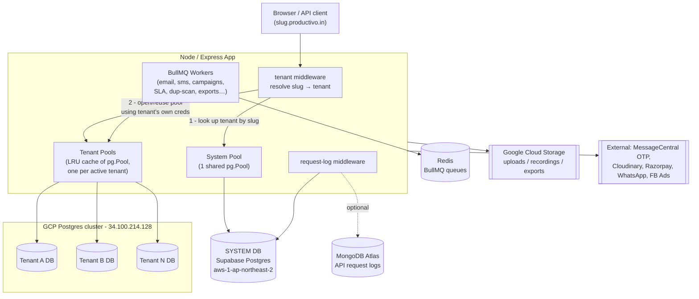
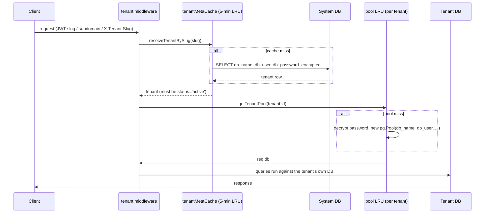
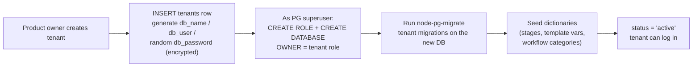

# Database Architecture — ExtraaEdge Server

A **database-per-tenant** multi-tenant architecture. There is one shared **System** database
(control plane) and **one physically separate database per tenant** (data plane), plus supporting
stores for queues, logs, and files.

This is verified from the code:
- [src/db/system.js](../src/db/system.js) — single shared system pool
- [src/db/tenant.js](../src/db/tenant.js) — LRU cache of per-tenant pools
- [src/middleware/tenant.js](../src/middleware/tenant.js) — per-request tenant resolution
- [src/services/tenant-provisioning.js](../src/services/tenant-provisioning.js) — `CREATE DATABASE` per tenant

---

## 1. The big picture

---

## 2. Two tiers, two responsibilities

| | **System DB (control plane)** | **Tenant DB (data plane)** |
|---|---|---|
| Engine | Supabase Postgres (`aws-1-ap-northeast-2`) | GCP Postgres (`34.100.214.128`), **one DB per tenant** |
| Connection | `DATABASE_URL` / `DIRECT_URL` — one shared pool | host fixed, but `database`/`user`/`password` come **per-tenant** from the `tenants` row |
| Pool code | `getSystemPool()` — singleton | `getTenantPool(tenant)` — LRU-cached, `max: 15` each |
| Holds | tenants, plans, platform users, billing, cross-tenant audit & request logs, support inbox, public admission tokens | everything tenant-owned: leads, users, calls, campaigns, workflows, payments, integrations… (~60 tables) |
| Who reads it | platform/product-owner features + every request's tenant lookup | the logged-in tenant's app traffic |

The **only bridge** between the two tiers is the `tenants` row: it stores each tenant's
`db_name`, `db_user`, and `db_password_encrypted` (AES-256-GCM). The app decrypts that to build
the tenant's connection pool on demand.

---

## 3. How a request reaches the right database

Slug resolution order (from `tenant.js` middleware):
1. `req.user.tenantSlug` from the JWT (most trusted)
2. Host subdomain — `speedup.productivo.in` → `speedup`
3. `X-Tenant-Slug` header (dev / API tooling)

Two caches keep this cheap:
- **`tenantMetaCache`** — slug → tenant metadata, 5-min TTL (saves the system-DB lookup)
- **`pools` LRU** — tenant id → live `pg.Pool`; evicting a pool calls `pool.end()` to free connections

---

## 4. How a tenant DB is born (provisioning)

From [src/services/tenant-provisioning.js](../src/services/tenant-provisioning.js):

This is why the tenant migrations live separately in
[src/db/migrations/tenant/](../src/db/migrations/tenant/) from the system ones in
[src/db/migrations/system/](../src/db/migrations/system/) — each set runs against a different DB.

---

## 5. Supporting datastores

| Store | Env | Purpose |
|---|---|---|
| **Redis** | `REDIS_URL` | BullMQ queues backing ~20 background workers (email/SMS/WhatsApp senders, campaign & drip runners, SLA scanner, duplicate scanner, bulk import/export, webhook dispatcher, attribution snapshotter, PDF reports). Degrades gracefully when absent (`redisAvailable()`). |
| **MongoDB Atlas** | `MONGO_URI` | API request-log sink (the heavy/verbose log stream; the structured cross-tenant log also lands in `platform_request_log` in the System DB). |
| **Google Cloud Storage** | `GCS_*` | Object store for uploads, call recordings, CSV imports, export results, PDF reports — referenced by `r2_key` columns across tenant tables. |
| **MessageCentral / Cloudinary / Razorpay / WhatsApp / FB Ads** | `MESSAGECENTRAL_*`, `cloud_*`, etc. | External service integrations (OTP, image CDN, payments, messaging, remarketing). |

---

## 6. Why database-per-tenant (the trade-offs this design takes)

**Wins**
- **Hard isolation** — a query can never leak across tenants; there is no `WHERE tenant_id = ?` to forget.
- **Per-tenant credentials** — each tenant DB has its own Postgres role; a leaked tenant secret can't touch others.
- **Independent scaling / migration / backup / restore** per tenant; noisy-neighbor blast radius is one DB.
- **Easy offboarding** — drop the database.

**Costs (and how the code handles them)**
- **Connection sprawl** → bounded by the **LRU pool cache** (`TENANT_POOL_LRU_MAX`); idle pools get evicted and closed.
- **Migration fan-out** → every schema change must run across all tenant DBs (the `run-tenant-migrations` lib + provisioning path).
- **Cross-tenant reporting is harder** → solved by mirroring key data into the System DB (`platform_request_log`, `support_tickets`, the lead-inspector module) so the product owner never opens a tenant DB directly.
- **Connection cost per tenant** → mitigated by the 5-min metadata cache so most requests skip the system-DB round-trip.

---

> For the table-level entity diagrams (columns, keys, relationships), see
> [DB-ERD.md](./DB-ERD.md).
