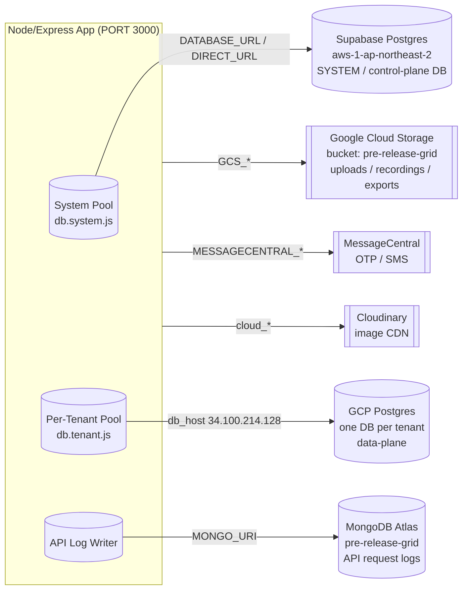
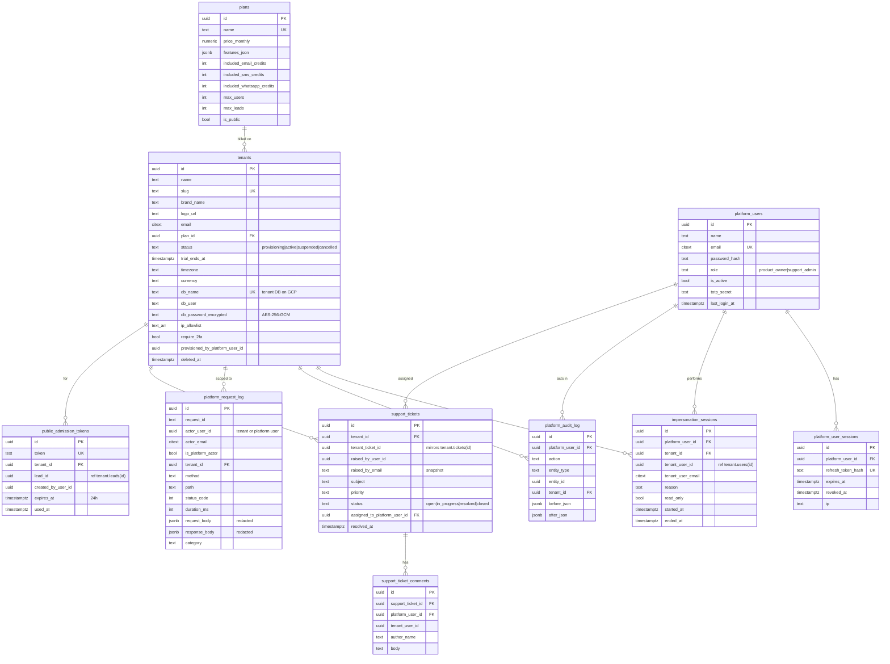
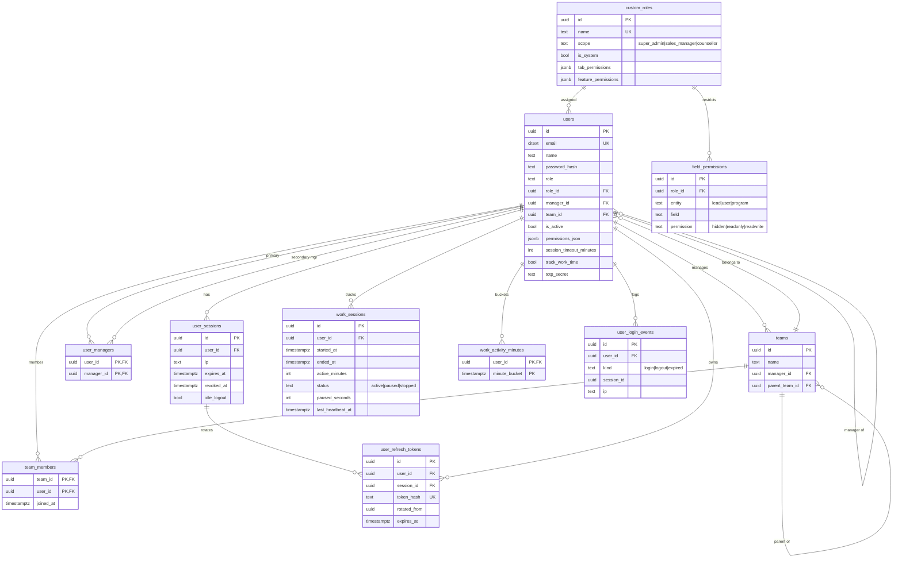
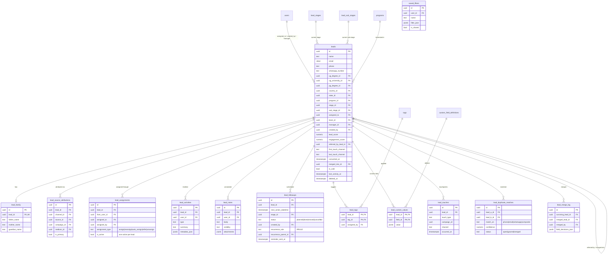
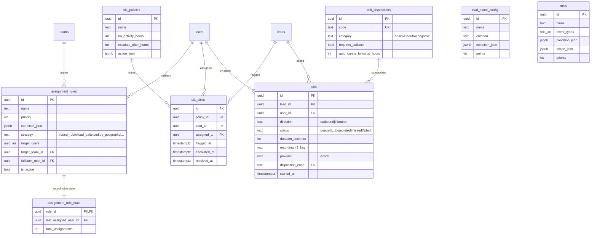

# Database Design — ExtraaEdge Server

This is a **multi-tenant SaaS CRM** for admissions/lead management. The data is split across
**two physically separate PostgreSQL clusters** plus a MongoDB log store, all wired up via the
`.env` connection strings.

## Architecture (from `.env`)



The **System DB** holds tenants, platform users, plans, billing, and cross-tenant audit/logs.
Each tenant's `tenants.db_name` / `db_user` / `db_password_encrypted` row tells the app how to
connect to that tenant's **own database** on the GCP cluster. The two databases are linked only
by `tenant_id` / `tenant_user_id` references that are **not** SQL foreign keys (they cross DB
boundaries) — shown below as dashed relationships.

---

## System DB (control plane — Supabase)



---

## Tenant DB — Identity, Access & Work Tracking



---

## Tenant DB — Dictionaries, Programs & Custom Fields

```mermaid
erDiagram
    lead_stages ||--o{ lead_sub_stages : "has"
    countries ||--o{ states : "has"
    countries ||--o{ universities : "located in"

    lead_stages {
        uuid id PK
        text name
        text code UK
        int order_index
        text color
        bool is_terminal
        int score
    }
    lead_sub_stages {
        uuid id PK
        uuid stage_id FK
        text name
        bool is_default
        int score
    }
    lead_channels { uuid id PK; text name UK }
    lead_sources_dict { uuid id PK; text name UK }
    lead_campaigns_dict { uuid id PK; text name UK }
    lead_mediums { uuid id PK; text name UK }
    countries { uuid id PK; text name UK; text iso }
    states { uuid id PK; uuid country_id FK; text name }
    genders { uuid id PK; text name UK }
    degrees { uuid id PK; text level; text name }
    specializations { uuid id PK; text name UK }
    universities { uuid id PK; text name UK; uuid country_id FK }
    programs {
        uuid id PK
        text name
        text code UK
        text category "abroad|domestic|coaching"
        text type "online|offline|hybrid"
        numeric price
        text intake_month
        bool is_featured
    }
    tags { uuid id PK; text name UK; text color; uuid created_by FK }
    custom_field_definitions {
        uuid id PK
        text entity "lead|user|program"
        text key
        text field_type
        jsonb options_json
        jsonb validation_json
        bool is_required
    }
```

---

## Tenant DB — Leads (the core entity)



---

## Tenant DB — Communications & Credits

```mermaid
erDiagram
    leads ||--o{ message_log : "sent to"
    leads ||--o{ message_reply : "replied"
    leads ||--o{ optin_log : "consent"
    users ||--o{ message_log : "sent by"
    users ||--o{ scheduled_sends : "scheduled by"
    whatsapp_numbers ||--o{ whatsapp_quota : "limited by"
    subscription_credits ||--o{ credit_transactions : "ledger"
    email_templates ||--o{ message_log : "rendered"
    sms_templates ||--o{ message_log : "rendered"
    whatsapp_templates ||--o{ message_log : "rendered"

    email_templates {
        uuid id PK
        text name
        text subject
        text body_html
        text status "Published|Draft|Archived"
        uuid created_by FK
    }
    sms_templates {
        uuid id PK
        text name
        text body
        text dlt_template_id
        uuid created_by FK
    }
    whatsapp_templates {
        uuid id PK
        text wabridge_template_name
        text category "MARKETING|UTILITY|AUTHENTICATION"
        text status "APPROVED|PENDING|REJECTED"
    }
    template_variables {
        uuid id PK
        text key UK
        text resolver_function
        text_arr scope
    }
    message_log {
        uuid id PK
        uuid lead_id FK
        uuid user_id FK
        text channel "email|sms|whatsapp"
        uuid template_id
        text recipient
        text provider
        text status "queued|sent|delivered|failed|seen|..."
        uuid campaign_id
        uuid workflow_run_id
        timestamptz sent_at
    }
    message_reply {
        uuid id PK
        uuid lead_id FK
        text channel
        text body
        uuid routed_to_user_id FK
        bool is_read
    }
    suppression_list {
        uuid id PK
        text channel
        text address
        text reason "unsubscribe|hard_bounce|stop_keyword|..."
    }
    optin_log {
        uuid id PK
        uuid lead_id FK
        text channel
        timestamptz opted_in_at
        timestamptz opted_out_at
    }
    whatsapp_numbers {
        uuid id PK
        text phone UK
        text wabridge_phone_number_id
        bool is_default
    }
    whatsapp_quota {
        uuid id PK
        uuid whatsapp_number_id FK
        int monthly_business_limit
        int daily_business_used
    }
    subscription_credits {
        uuid id PK
        text credit_type UK "email|sms|whatsapp_business|whatsapp_session"
        numeric balance
        numeric monthly_allocation
    }
    credit_transactions {
        uuid id PK
        text credit_type
        numeric amount
        text reason
        uuid ref_id
    }
    scheduled_sends {
        uuid id PK
        uuid user_id FK
        text channel
        uuid template_id
        uuid_arr lead_ids
        timestamptz scheduled_for
        text status "scheduled|running|completed|cancelled|failed"
    }
```



---

## Tenant DB — Campaigns & Workflows

```mermaid
erDiagram
    email_templates ||--o{ campaigns_bulk : "uses"
    sms_templates ||--o{ campaigns_bulk : "uses"
    whatsapp_templates ||--o{ campaigns_bulk : "uses"
    campaigns_bulk ||--|| campaigns_bulk_stats : "summarized by"
    campaigns_drip ||--o{ campaigns_drip_rules : "has steps"
    campaigns_drip ||--o{ campaigns_drip_runs : "executes"
    campaigns_drip_rules ||--o{ campaigns_drip_runs : "via step"
    leads ||--o{ campaigns_drip_runs : "enrolled"
    message_log ||--o{ campaigns_drip_runs : "produces"

    workflow_categories ||--o{ workflows : "groups"
    workflows ||--o{ workflow_nodes : "has"
    workflows ||--o{ workflow_edges : "has"
    workflow_nodes ||--o{ workflow_edges : "from/to"
    workflows ||--o{ workflow_runs : "executes"
    workflow_runs ||--o{ workflow_run_events : "logs"
    leads ||--o{ workflow_runs : "for lead"

    campaigns_bulk {
        uuid id PK
        text name
        text stage "DRAFT|IN_PROGRESS|COMPLETED|STOPPED"
        text channel "email|sms|whatsapp|multi"
        jsonb audience_filter_json
        uuid email_template_id FK
        uuid sms_template_id FK
        uuid whatsapp_template_id FK
        timestamptz scheduled_at
        uuid created_by FK
    }
    campaigns_bulk_stats {
        uuid campaign_id PK,FK
        int leads_count
        int email_delivered
        int sms_delivered
        int wa_delivered
    }
    campaigns_drip {
        uuid id PK
        text name
        bool active
        uuid created_by FK
    }
    campaigns_drip_rules {
        uuid id PK
        uuid drip_id FK
        int step_order
        int day_offset
        text channel
        uuid template_id
        jsonb condition_json
    }
    campaigns_drip_runs {
        uuid id PK
        uuid drip_id FK
        uuid lead_id FK
        uuid step_id FK
        text status "queued|sent|failed|skipped"
        uuid message_log_id FK
    }
    workflow_categories { uuid id PK; text name UK }
    workflows {
        uuid id PK
        text name
        uuid category_id FK
        text_arr trigger_event_types
        bool is_active
        uuid created_by FK
    }
    workflow_nodes {
        uuid id PK
        uuid workflow_id FK
        text type "trigger|action|condition|wait"
        jsonb config_json
    }
    workflow_edges {
        uuid id PK
        uuid workflow_id FK
        uuid from_node_id FK
        uuid to_node_id FK
        text label
    }
    workflow_runs {
        uuid id PK
        uuid workflow_id FK
        uuid lead_id FK
        text status "running|succeeded|failed|cancelled"
        uuid current_node_id FK
        jsonb context_json
    }
    workflow_run_events {
        uuid id PK
        uuid run_id FK
        uuid node_id FK
        text event_type
        jsonb payload_json
    }
```

---

## Tenant DB — Rules, SLA, Assignment, Calls



---

## Tenant DB — Payments, Referrals, Attribution

```mermaid
erDiagram
    leads ||--o{ payment_links : "billed"
    leads ||--o{ payments : "pays"
    payment_links ||--o{ payments : "fulfilled by"
    payments ||--|| payment_attributions : "attributed"
    leads ||--o{ lead_referral_codes : "owns code"
    referral_policies ||--o{ referral_credits : "governs"
    leads ||--o{ referral_credits : "referrer"
    leads ||--o{ referral_credits : "referred"

    payment_links {
        uuid id PK
        uuid lead_id FK
        numeric amount
        text provider "razorpay"
        text provider_link_id
        text status "created|paid|expired|cancelled"
        uuid created_by FK
    }
    payments {
        uuid id PK
        uuid lead_id FK
        uuid payment_link_id FK
        numeric amount
        text provider_payment_id UK
        text status "captured|failed|refunded|pending"
        text method "card|upi|netbanking"
        timestamptz paid_at
        jsonb raw_webhook_json
    }
    payment_webhook_log {
        uuid id PK
        text provider
        text event_type
        jsonb body_json
        timestamptz processed_at
    }
    payment_attributions {
        uuid payment_id PK,FK
        uuid lead_id FK
        uuid first_touch_campaign_id
        uuid last_touch_campaign_id
        numeric amount_attributed_first
        numeric amount_attributed_last
        text attribution_model "50_50"
    }
    lead_referral_codes {
        uuid id PK
        uuid lead_id FK
        text code UK
        int uses_count
        int max_uses
        bool is_active
    }
    referral_policies {
        uuid id PK
        text name
        text trigger "lead_created|payment_succeeded|enrolled"
        text credit_type "points|cash|discount|custom"
        numeric credit_amount
    }
    referral_credits {
        uuid id PK
        uuid referrer_lead_id FK
        uuid referred_lead_id FK
        uuid policy_id FK
        text status "pending|credited|revoked"
        timestamptz triggered_at
    }
```



---

## Tenant DB — Integrations, Webhooks, OTP & Ops

```mermaid
erDiagram
    integrations ||--o{ inbound_webhooks : "exposes"
    integrations ||--o{ webhook_events : "receives"
    outbound_webhooks ||--o{ outbound_webhook_deliveries : "delivers"
    fb_ad_accounts ||--o{ fb_audiences : "owns"
    leads ||--o{ otp_verifications : "verifies"
    users ||--o{ otp_verifications : "verifies"
    users ||--o{ uploaded_files : "uploads"
    users ||--o{ bulk_imports : "runs"
    bulk_import_previews ||--o{ bulk_imports : "previewed"
    bulk_imports ||--o{ bulk_import_failures : "rejected rows"
    users ||--o{ bulk_exports : "exports"
    users ||--o{ tickets : "raises"
    tickets ||--o{ ticket_comments : "discussed"
    users ||--o{ notifications : "notified"
    users ||--|| notification_preferences : "configures"

    integrations {
        uuid id PK
        text type "facebook_ads|google_ads|zapier|..."
        text name
        jsonb credentials_encrypted
        text status "published|unpublished|error"
    }
    inbound_webhooks {
        uuid id PK
        uuid integration_id FK
        text secret_token UK
        jsonb field_mapping_json
        int hit_count
    }
    webhook_events {
        uuid id PK
        uuid integration_id FK
        jsonb payload_json
        text status "pending|processed|failed"
    }
    outbound_webhooks {
        uuid id PK
        text name
        text target_url
        text_arr event_types
        jsonb retry_config_json
    }
    outbound_webhook_deliveries {
        uuid id PK
        uuid webhook_id FK
        text event_type
        int attempt
        text status "pending|delivered|failed|dead"
        timestamptz next_retry_at
    }
    fb_ad_accounts {
        uuid id PK
        text ad_account_id UK
        text access_token_encrypted
    }
    fb_audiences {
        uuid id PK
        uuid fb_ad_account_id FK
        jsonb audience_filter_json
        text sync_status "pending|synced|failed"
    }
    otp_verifications {
        uuid id PK
        uuid lead_id FK
        uuid user_id FK
        text purpose "mobile_verify|email_verify|2fa"
        text channel "sms|email"
        text otp_hash
        timestamptz expires_at
    }
    business_hours {
        uuid id PK
        int day_of_week "0-6"
        bool is_open
        time open_time
        time close_time
    }
    holidays { uuid id PK; date date UK; text name }
    uploaded_files {
        uuid id PK
        uuid user_id FK
        text r2_key UK
        text purpose "avatar|brochure|recording|..."
        text ref_entity_type
        uuid ref_entity_id
    }
    bulk_import_previews {
        uuid id PK
        uuid user_id FK
        jsonb field_mapping_json
        int total_rows
        int valid_rows
        int duplicate_rows
    }
    bulk_imports {
        uuid id PK
        uuid user_id FK
        uuid preview_id FK
        text source "csv|webhook|api"
        text status "queued|processing|completed|failed"
        text duplicate_handling "skip|update_existing|create_new"
    }
    bulk_import_failures {
        uuid id PK
        uuid import_id FK
        int row_number
        jsonb raw_row_json
        text error_message
    }
    bulk_exports {
        uuid id PK
        uuid user_id FK
        jsonb filter_json
        text status "queued|processing|completed|failed"
        text file_r2_key
    }
    audit_log {
        uuid id PK
        uuid user_id FK
        text actor_type "tenant_user|platform_owner|system"
        text action
        text entity_type
        uuid entity_id
    }
    tickets {
        uuid id PK
        uuid user_id FK
        text subject
        text priority "low|normal|high|urgent"
        text status "open|in_progress|resolved|closed"
        uuid assigned_to_platform_user_id
    }
    ticket_comments {
        uuid id PK
        uuid ticket_id FK
        uuid user_id FK
        uuid platform_user_id
        text body
    }
    notifications {
        uuid id PK
        uuid user_id FK
        text type
        text message
        bool is_read
    }
    notification_preferences {
        uuid user_id PK,FK
        bool in_app
        bool email
        bool sms
        text digest_frequency "immediate|hourly|daily"
    }
```

---

## Cross-database links (not SQL FKs)

These references span the System and Tenant databases, so they are application-enforced only:

| From (System DB) | Field | To (Tenant DB) |
|---|---|---|
| `tenants` | `db_name` / `db_user` / `db_password_encrypted` | the tenant's entire database on GCP |
| `impersonation_sessions` | `tenant_user_id`, `tenant_user_email` | `users.id` / `users.email` |
| `support_tickets` | `tenant_ticket_id`, `raised_by_user_id` | `tickets.id` / `users.id` |
| `public_admission_tokens` | `lead_id` | `leads.id` |
| `platform_request_log` | `actor_user_id` | `users.id` (tenant) or `platform_users.id` |
| `tickets` (tenant) | `assigned_to_platform_user_id` | `platform_users.id` (system) |
